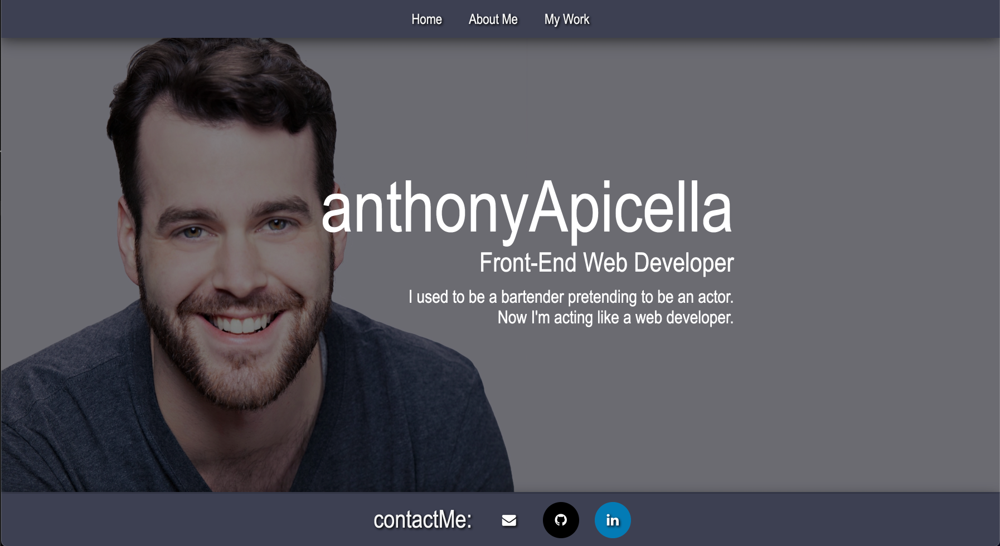

# anthonyApicella

## Front-End Web Developer Portfolio

*This site serves as a digital portfolio, showcasing my work as a Web Developer.*

*When I began, I admittedly was a bit lost. There was a lot of "Frankenstiening" of code and I didn't have an end in sight. But I* *did have a ton of bugs. Flex wasn't being very flexible.*

*On my last night of work, I decided to wipe the .CSS clean and plug each element back in one at a time. This allowed me to very* *plainly see what I was doing wrong and served as a wonderful refresher to last weeks subject material.*

*After a few hours I finally did it! I'm proud of this site and I look forward to growing it and increasing it's complexity!*

---

## Features

- Fully accessible web application with responsve design
- Static navbar with working links to "About Me", "My Work" and "Contact" sections
- Image links to "Projects" that enlarge upon user interaction. (Links will open in new tab)
- Contact buttons in static footer section. (Links will open in new tab)

## Screenshot
